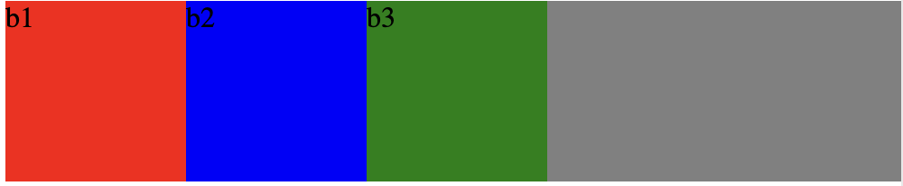
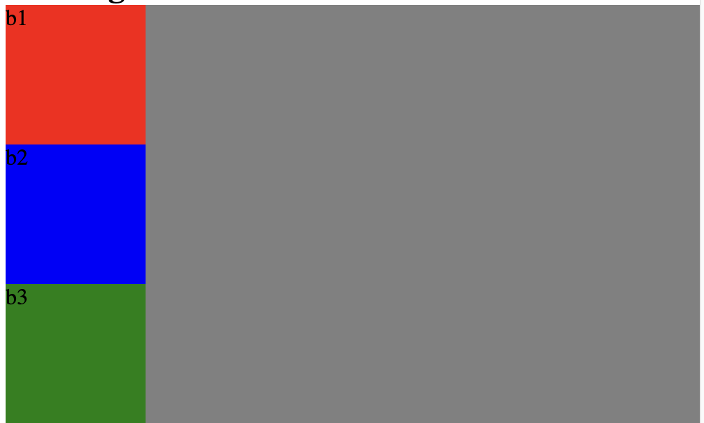
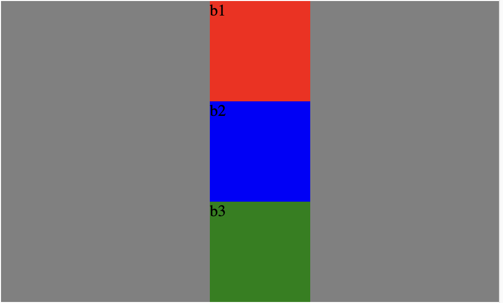
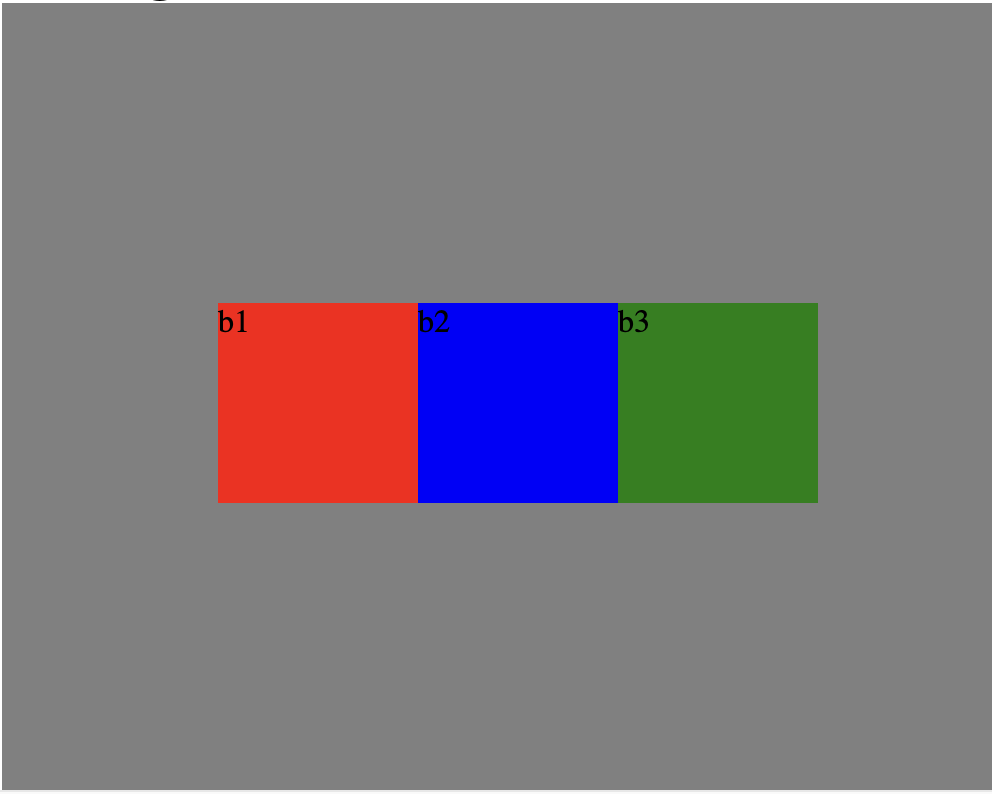
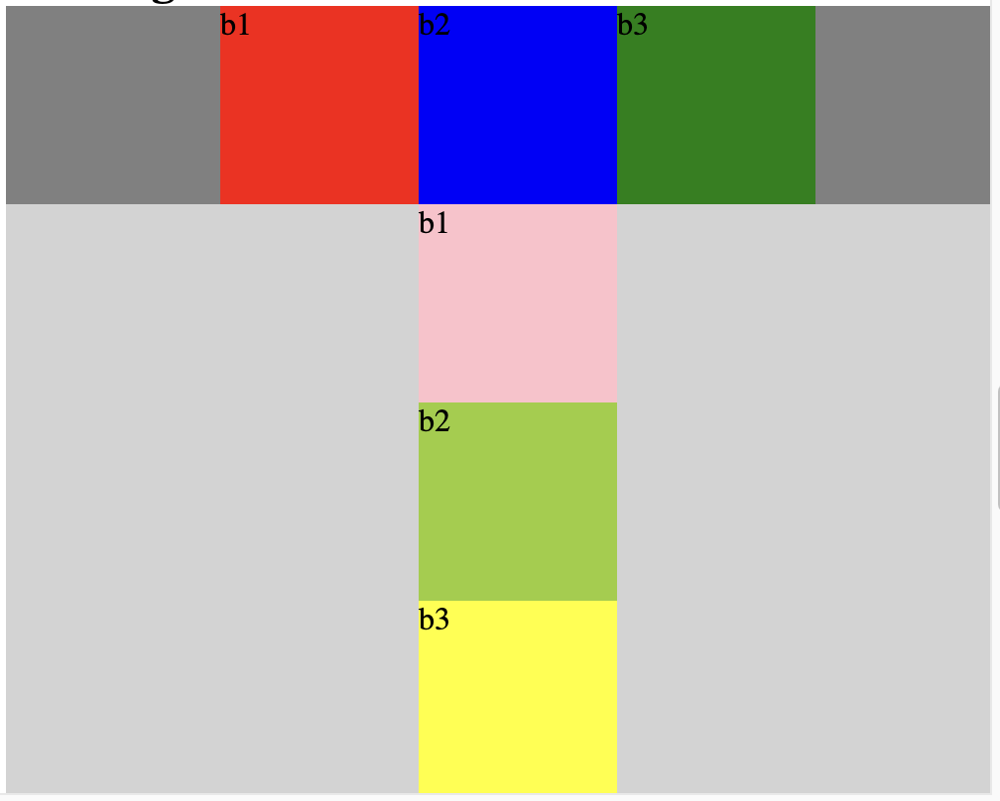
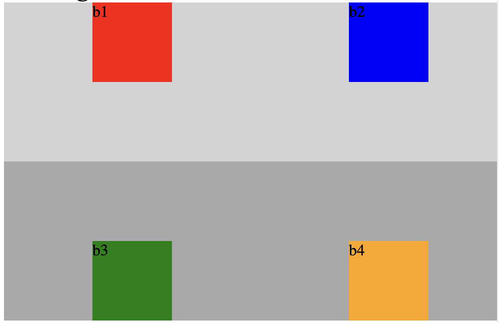
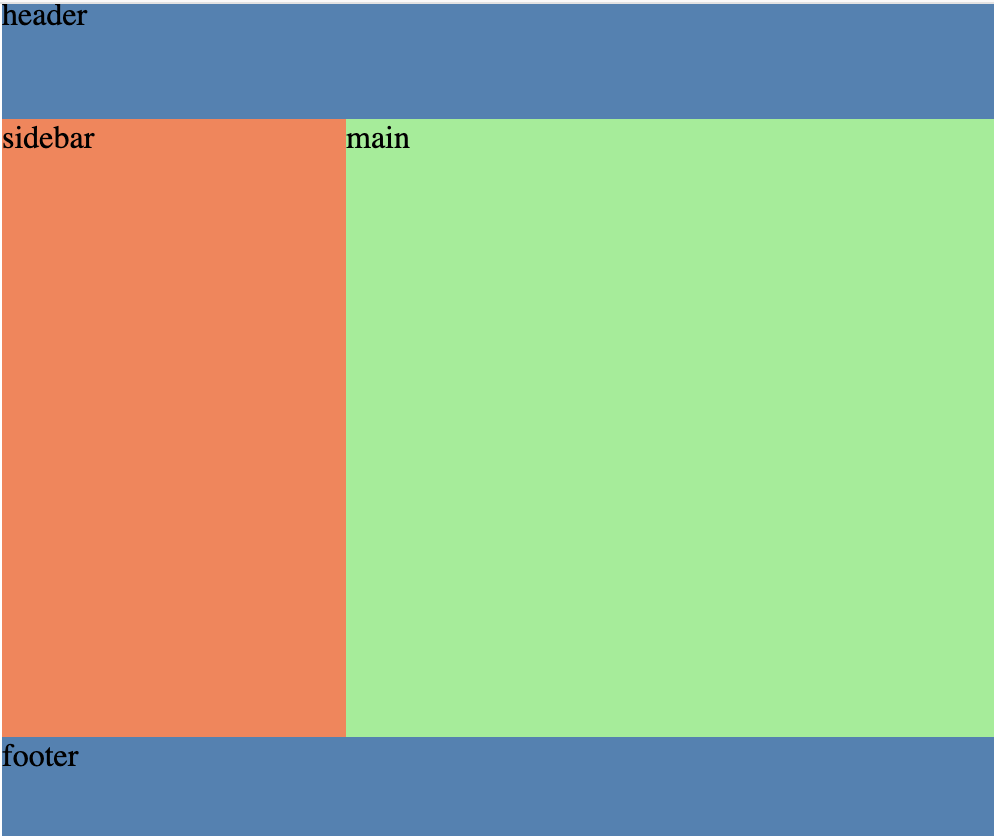

# Flexbox-practice

Welcome! Below are the mock-ups for each challenge. Use these as a reference to guide your work — your finished page should match the layout and style shown in each image.

All your work is being done in the style.css file!!!

---

## Challenge 1

**Goal:** Make the boxes sit in a row.

---

## Challenge 2

**Goal:** Make the boxes stack in a column.

---

## Challenge 3

**Goal:** Stack the boxes and center them vertically.

---

## Challenge 4

**Goal:** Row of boxes centered horizontally and vertically.

---

## Challenge 5

**Goal:** Two sections:
1. Top row of boxes centered horizontally
2. Bottom row column of boxes centered horizontally

---

## Challenge 6

**Goal:** Nested flex. There are three containers, each one has a rule that you will need to use flex properties to match the layout. You will also need to use `flex: 1` on the children — the rest are properties you have used in past challenges.

---

## Challenge 7

**Goal:** Classic page layout:
1. Header on top, full width
2. Sidebar + main side by side in the middle
3. Footer on the bottom, full width

For this part you will have to use the `flex` property on the child sections so that they fill out their section nicely. `flex: 1` means it will take up equal space as its neighbor — you might want to play around with the numbers to get it correct.

---

> **Tip:** Click on any image to open it full size if you need a closer look at the details.